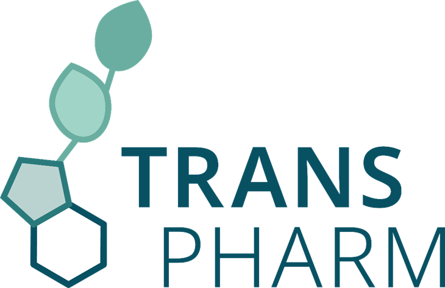

# Chemperium
*Portmanteau of the Latin words Chemia and Imperium: "a chemical empire"*. <br><br>
Chemperium is a deep learning toolkit that aims to conquer the chemical space of compounds and properties. 
The main focus of this tool is on the applicability and accuracy of trained models.
While many publications, tools, and datasets are out on molecular property prediction, 
we target both experts and non-experts in cheminformatics to make fast and accurate predictions. <br>
In this package, we provide a validated software tool and trained machine learning models 
to make reliable molecular property predictions with a minimum of code and time.

## Table of Contents
- [Installation](#1-installation)
- [Usage](#2-usage)
  * [Predicting Properties](#predicting-properties-with-chemperium)
    + [Liquid-Phase Properties](#liquid-phase-properties)
    + [Thermochemistry](#thermochemistry)
  * [Training Models](#training-machine-learning-models)
  * [Testing Models](#testing-trained-machine-learning-models)
  * [Representation Learning](#creating-a-learned-representation)
- [Scripts](#3-scripts)
  * [Command-Line Training](#training-a-model-via-command-line)
  * [Command-Line Testing](#testing-a-model-via-command-line)
- [Tutorial](#4-scripts)
- [Datasets](#5-datasets)
- [Reference](#6-reference)

## 1. Installation
Chemperium is built upon NumPy, Pandas, RDKit, TensorFlow, Keras, and Scikit-Learn. 
The package can be installed using pip:

Install a virtual environment in Anaconda:
```
conda create -n chemperium python=3.11
conda activate chemperium
```

```
git clone https://github.com/mrodobbe/chemperium.git
cd chemperium
pip install .
```

## 2. Usage
Chemperium can be loaded as a python package by importing `chemperium`. 
There are various options to predict properties of molecules or to train new models. 

### Predicting properties with chemperium
A distinction is made between liquid-phase properties and thermochemistry.
#### **Liquid-phase properties** 
Liquid-phase properties are predicted with the module `chemperium.training.predict.Liquid`.
In this module, it is necessary to specify the target property, the dimension of molecular information (2D or 3D), 
and the location of the trained models.

<br>*2D example for boiling point*<br> 

  ```
  import chemperium as cp
  
  bp_model = cp.Liquid("bp", "2d", <folder>)
  prediction = bp_model.predict("COc1ccccc1")
  ```

(currently supported properties: `bp`, `tc`, `pc`, `vp`, `logp`, `logs`)<br><br>
#### **Thermochemistry**
The prediction of thermochemical properties is done in a similar way 
with the module `chemperium.training.predict.Thermo`. A distinction is made in the functions to predict enthalpy of formation, entropy of formation, 
and gibbs free energy of formation. 
It is possible to predict at temperatures between 298 K and 1500 K. 
When 3D predictions are chosen, Δ-machine learning will be used and a lower level-of-theory estimate should be provided. 
At this moment, all predictions are in `kcal/mol` for enthalpy and `cal/mol/K` for entropy.

<br>*3D example for CBS-QB3*<br> 

  ```
  import chemperium as cp

  smi = "COc1ccccc1"
  xyz = '16\n' \
        '\n' \
        'C          2.76930        0.32250       -0.00050\n' \
        'O          1.76340       -0.67620       -0.00000\n' \
        'C          0.45600       -0.27750       -0.00000\n' \
        'C         -0.49220       -1.31180       -0.00020\n' \
        'C         -1.84930       -1.01160       -0.00010\n' \
        'C         -2.28360        0.31900        0.00010\n' \
        'C         -1.33830        1.34160        0.00020\n' \
        'C          0.03130        1.05620        0.00020\n' \
        'H          3.72200       -0.21080       -0.00090\n' \
        'H          2.71000        0.95720       -0.89500\n' \
        'H          2.71080        0.95730        0.89390\n' \
        'H         -0.13750       -2.33800       -0.00030\n' \
        'H         -2.57430       -1.82150       -0.00030\n' \
        'H         -3.34470        0.55070        0.00010\n' \
        'H         -1.65940        2.38020        0.00040\n' \
        'H          0.74700        1.87060        0.00030'
  llot = -5.13245
  
  thermo = cp.Thermo("cbs-qb3", "3d", <folder>)

  # Predict the standard enthalpy of formation at 298 K
  h298_prediction = thermo.predict_enthalpy(smi, xyz, llot, quality_check=True)
  
  # Predict the Gibbs free energy at 1000 K
  g1000_prediction = thermo.predict_gibbs(smi, xyz, llot, t=1000)
  
  # Predict the thermochemistry in Chemkin format
  chemkin_inp = thermo.get_nasa_polynomials("anisole", smi, xyz, llot, chemkin=True)
  ```


### Training machine learning models
The `Thermo` and `Liquid` modules are trained in advance. It is also possible to train models by yourself. 
For this purpose, the function `chemperium.training.train.train` is needed.
It requires three arguments: the location of a CSV file with training data, 
a list with target properties, and (optionally) a dictionary with training arguments.
<br><br>
*Training a 3D MPNN for prediction of logP and logS*:

```
import chemperium as cp

csv_location = "examples/example_data.csv"
props = ["logp", "logs"]
save_dir = "examples/output"
input_args = {"rdf": True, 
              "cutoff": 2.1, 
              "num_layers": 3, 
              "hidden_size": 128, 
              "depth": 4}
cp.train(csv_location, props, save_dir, input_args)
```


### Testing trained machine learning models
Property prediction models that have been trained with the function `chemperium.training.train.train` can 
be used for predicting properties using the module `chemperium.training.test.test`. 
The usage is highly resembling to the `train` function and requires following information:
* `smiles`: a list with SMILES identifiers
* `prop`: the target property/ies
* `save_dir`: the folder where the models are stored
* `xyz`: (optional) List with 3D coordinates of the target compounds
* `return_results`: (optional) A bool that states whether results should be returned as DataFrame. Defaults to False
* `input_args`: (optional) Dictionary with training arguments of the trained models

*Testing a 3D MPNN for prediction of logP and logS*:

```
import chemperium as cp

smi = ["COc1ccccc1"]
xyz = ['16\n' \
       '\n' \
       'C          2.76930        0.32250       -0.00050\n' \
       'O          1.76340       -0.67620       -0.00000\n' \
       'C          0.45600       -0.27750       -0.00000\n' \
       'C         -0.49220       -1.31180       -0.00020\n' \
       'C         -1.84930       -1.01160       -0.00010\n' \
       'C         -2.28360        0.31900        0.00010\n' \
       'C         -1.33830        1.34160        0.00020\n' \
       'C          0.03130        1.05620        0.00020\n' \
       'H          3.72200       -0.21080       -0.00090\n' \
       'H          2.71000        0.95720       -0.89500\n' \
       'H          2.71080        0.95730        0.89390\n' \
       'H         -0.13750       -2.33800       -0.00030\n' \
       'H         -2.57430       -1.82150       -0.00030\n' \
       'H         -3.34470        0.55070        0.00010\n' \
       'H         -1.65940        2.38020        0.00040\n' \
       'H          0.74700        1.87060        0.00030']
props = ["logp", "logs"]
save_dir = "examples/output"
input_args = {"rdf": True, 
              "cutoff": 2.1, 
              "num_layers": 3, 
              "hidden_size": 128, 
              "depth": 4}
results = cp.test(smi, props, save_dir, xyz, True, input_args)
```

### Creating a learned representation


## 3. Scripts
It is also possible to train and test models via command line. Below, we show the example from 
[Training](#training-machine-learning-models) and [Testing](#testing-trained-machine-learning-models).
### Training a model via command line
The script can be found in scripts/train.py.
```
python train.py --data "examples/example_data.csv" --save_dir "examples/output" --property "logp,logs" 
--rdf --cutoff 2.1 --num_layers 3 --hidden_size 128 --depth 4
```

### Testing a model via command line
```
python test.py --test_data "examples/example_test_data.csv" --save_dir "examples/output" --property "logp,logs" 
--rdf --cutoff 2.1 --num_layers 3 --hidden_size 128 --depth 4
```

## 4. Tutorial
Add link to demo here!

## 5. Datasets
Add link to Zenodo here!

## 6. Reference
Add citation here!

## Acknowledgments
This software tool has been developed with support from the Research Fund of Flanders (FWO-Vlaanderen, grant 1S45522N), 
the European Research Council (ERC grant 818607), and the European Union's Horizon Programme (grant 101057816, 
"TransPharm").


 <br> <br>
        

